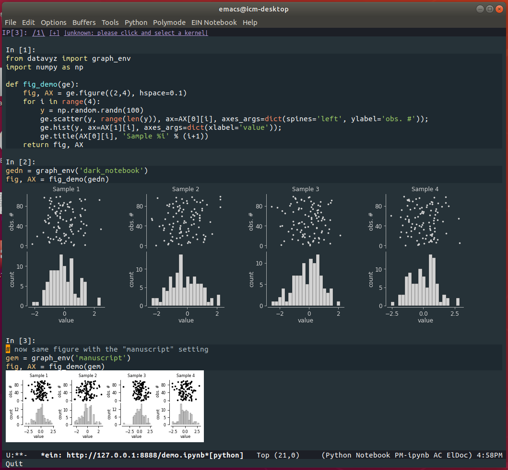
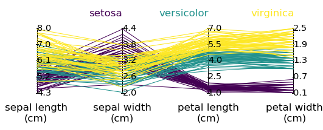
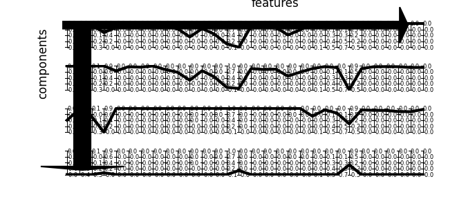
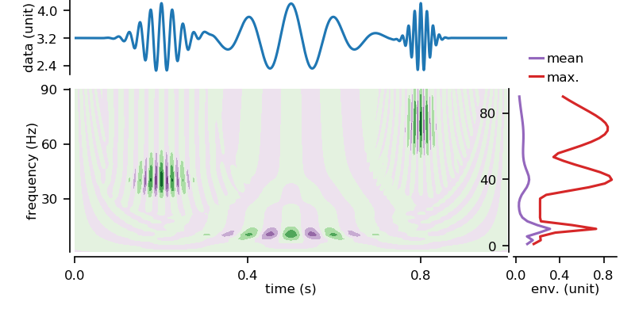
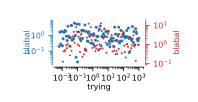
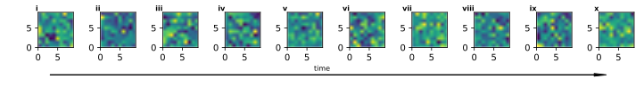

<div></div>

# datavyz

*From data exploration to final figure production, get your plots right, all along your analysis pipeline.*

*A layer on top of `matplotlib` to achieve flexible & high-standard data visualization across mediums.*

Part of the software suite for data science: [analyz](https://github.com/yzerlaut/analyz), [datavyz](https://github.com/yzerlaut/datavyz), [finalyz](https://github.com/yzerlaut/finalyz)

## Motivation / Principle

The motivation behind this extension of the *matplotlib* library is two-fold:

- the default settings of *matplotlib* do not really match the relatively specific constraints (on fontsize, axes size, etc...) of figure production in scientific journals from publishers such as Nature/Springer, Elsevier, Cell Press, ... See the [Cell Press figure guidelines](https://www.cell.com/figureguidelines) for an example of such instructions.

- a single graphical setting to display figures is not very practical in the process of scientific analysis. Such analysis is usually made of several steps and is performed on different mediums: notebooks with embedded figures, script that produce on-display figures, multipanel figures on A4 page, ...

Therefore, at the core is this library, lies the concept of a *Graphical Environment" (implemented as the `graph_env` class). It is a set of settings that will best adapt to the specific medium used (and will generalize to others). Create a graph environment associated to a specific visualization setting, below "screen":

```
from datavyz import graph_env
ge = graph_env('screen')
```
You then call all of your plotting functions relative to this environment, e.g.:

```
import numpy # to generate random data
ge.plot(Y=numpy.random.randn(4, 10), sY=numpy.random.randn(4, 10),
        xlabel='xlabel (xunit)', ylabel='ylabel (yunit)', title='datavyz demo plot')
ge.show()
```
pops up:
<p align="center">
  
</p>

## Installation

Using *git* to clone the repository and "pip" to install the package in your python environment:

```
pip install git+https://github.com/yzerlaut/datavyz.git
```

## Multipanel figure demo

Building a complex multipanel figure such as the following:

<p align="center">
  
</p>

is made easy with the module, the above figure is generated by the following code

```
from datavyz import ge # load the default graph environment ("manuscript")

# generate some random data
t = np.linspace(0, 10, 1e3)
y = np.cos(5*t)+np.random.randn(len(t))

# Panel 'a' - schematic (drawn with Inkscape for example)
fig11 = 'docs/schematic.svg' # just pass a filename

# Panel 'b' - time series plot
fig12, ax12 = ge.figure(axes_extents=(3,1)) # i.e. a wide plot
ax12.plot(t, y)
ge.set_plot(ax12, xlabel='xlabel (xunit)', ylabel='ylabel (yunit)')

# Panel 'c' - more time series plot
fig21, ax21 = ge.figure(axes_extents=(4,1)) # i.e. a very wide plot
ax21.plot(t[t>9], y[t>9], label='raw')
ax21.plot(t[t>9][1:], np.diff(y[t>9]), label='deriv.')
ax21.plot(t[t>9][1:-1], np.diff(np.diff(y[t>9])), label='2nd deriv.')
ge.set_plot(ax21, xlabel='xlabel (xunit)', ylabel='ylabel (yunit)')
ge.legend(ax21, ncol=3, loc=(.3,1.)) # put a legend

# Panel 'd' - scatter plot
fig31, ax31 = ge.scatter(t[::10], t[::10]+np.random.randn(100),
                         xlabel='ylabel (yunit)')

# Panel 'e' - bar plot
fig32, ax32 = ge.bar(np.random.randn(8),
                     COLORS=[ge.viridis(i/7) for i in range(8)],
                     xlabel='ylabel (yunit)')

# Panel 'f' - bar plot
fig33, ax33 = ge.pie([0.25,0.4,0.35], ext_labels=['Set 1', 'Set 2', 'Set 3'])

# Panel 'g' - bar plot
fig34, ax34 = ge.hist(np.random.randn(200))

ge.multipanel_figure([[fig11, fig12],
                      [fig21],
                      [fig31,fig32,fig33,fig34]],
                     LABELS=[['a','b'],
                             ['c'],
                             ['d', 'e', 'f', 'g']],
                     width='double-column', # can also be "single-column" or "one-and-a-half-column"
                     fig_name='docs/multipanel.svg',
                     grid=False, # switch to True to get the Grid position and pricesely place labels if necessary
                     autoposition=True)

```

## Graphical environments

You can specifiy different environments corresponding to different visualization settings.

Below is an example `settings.py` file (see `datavyz/settings.py`), it defines two graphical environments: **"manuscript"** and **"notebook"**.

```
ENVIRONMENTS = {} # dictionary storing the different environments

"""
MANUSCRIPT ENVIRONMENT
"""
ENVIRONMENTS['manuscript'] = {
    'fontsize':8,
    'default_color':'k',
    'single_plot_size':(22., 16.), # mm
    'hspace_size':10., # mm
    'wspace_size':14., # mm
    'left_size':16., # mm
    'right_size':4., # mm
    'top_size':7., # mm
    'bottom_size':13., # mm
    'background':'w',
    'facecolor':'w',
    'transparency':False,
    'dpi':150,
    'size_factor': 1.,
    'markersize':2.5,
}

"""
DARK NOTEBOOK ENVIRONMENT
"""
ENVIRONMENTS['dark_notebook'] = {
	'fontsize':13,
        'default_color':'lightgray',
        'single_plot_size':(28.*2., 20.*2.), # mm
        'hspace_size':12.*2., # mm
        'wspace_size':16.*2., # mm
        'left_size':20*2., # mm
        'right_size':4.*2., # mm
        'top_size':7.*2., # mm
        'bottom_size':19.*2., # mm
        'background':'none',
        'facecolor':'none',
        'transparency':True,
        'dpi':200,
}
```

We illustrate the use of those two environments in the [demo notebook](skjdfh). 

One first design an analysis in a convenient environment to explore
data, here **"dark_notebook"** (integrated within the excellent [Emacs
IPython Notebook
(EIN)](http://millejoh.github.io/emacs-ipython-notebook/) interface
that allows you to run Jupyter notebooks within Emacs). In a final
step, one exports the figure, using the **"manuscript"** environment,
for its inlusion in a report.

<p align="center">
  
</p>

## Size settings


<p align="center">
  
</p>


## Features

We document here the different plotting features covered by the library:

### Pie plots

```
# building data
data = .5+np.random.randn(3)*.4

#plotting
fig, ax = ge.pie(data,
				 ext_labels = ['Data1', 'Data2', 'Data3'],
				 pie_labels = ['%.1f%%' % (100*d/data.sum()) for d in data],
				 ext_labels_distance=1.2,
				 explodes=0.05*np.ones(len(data)),
				 center_circle=0.2,
				 COLORS = [ge.tab20(x) for x in np.linspace(0,1,len(data))],
				 # pie_args=dict(rotate=90), # e.g. for rotation
				 legend=None) 
				 # set legend={} to have it appearing
fig.savefig('./docs/pie-plot.png', dpi=200)
```
Output:

<p align="center">
  
</p>

### Features plot

```
# data: breast cancer dataset from datavyz.klearn
from datavyz.klearn.datasets import load_breast_cancer
raw = load_breast_cancer()

# re-arange for plotting
data = {}
for feature, values in zip(raw['feature_names'], raw['data']):
	data[feature+'\n(log)'] = np.log(values)

# plotting
fig, AX = ge.features_plot(data, ms=3,
						   fig_args={'left':.1, 'right':.3, 'bottom':.1, 'top':.1,
									 'hspace':.4, 'wspace':.4})
fig.savefig('docs/features-plot.png', dpi=200)
```
<p align="center">
  
</p>

### Cross-correlation plot

Look at the cross-correlation between several joint measurements and estimate the signficance of the correlation:
```
# building random data
data = {}
for i in range(7):
	data['feature_%s'%(i+1)] = np.random.randn(30)

# plotting
fig = ge.cross_correl_plot(data,
                          features=list(data.keys())[:7])

fig.savefig('./docs/cross-correl-plot.png', dpi=200)
```
Output:

<p align="center">
  
</p>


### Bar plots

#### Classical bar plot

```
ge.bar(np.random.randn(5), yerr=.3*np.random.randn(5), bottom=-3, COLORS=ge.colors[:5])
```

#### Related sample measurements
```
fig, ax, pval = ge.related_samples_two_conditions_comparison(np.random.randn(10)+2., np.random.randn(10)+2.,
															 xticks_labels=['$\||$cc($V_m$,$V_{ext}$)$\||$', '$cc(V_m,pLFP)$'],
															 xticks_rotation=45, fig_args={'bottom':1.5, 'right':8.})
fig.savefig('docs/related-samples.png', dpi=200)
```

<p align="center">
  
</p>

#### Unrelated sample measurements
```
fig, ax, pval = ge.unrelated_samples_two_conditions_comparison(np.random.randn(10)+2., np.random.randn(10)+2.,
															   xticks_labels=['$\||$cc($V_m$,$V_{ext}$)$\||$', '$cc(V_m,pLFP)$'],
															   xticks_rotation=45, fig_args={'bottom':1.5, 'right':8.})
fig.savefig('docs/unrelated-samples.png', dpi=200)
```

<p align="center">
  
</p>

### Line plots

#### Simple trace plot with X-and-Y bars for the labels

```
fig, ax = ge.plot(t, x,
                  fig_args=dict(figsize=(3,1), left=.4, bottom=.5),
                  bar_scale_args = dict(Xbar=.2,Xbar_label='0.2s',
                                        Ybar=20,Ybar_label='20mV ',
                                        loc='left-bottom'))
```

<p align="center">
  
</p>

### Scatter plots

```
from datavyz import graph_env
ge = graph_env('manuscript')

fig, ax = ge.scatter(Y=np.random.randn(4, 10),
                     sY=np.random.randn(4, 10),
                     xlabel='xlabel (xunit)',
                     ylabel='ylabel (yunit)',
                     title='datavyz demo plot')
```

<p align="center">
  
</p>

### Surface plots

```
# BUILDING THE DATA
x, y = np.meshgrid(np.arange(1, 11), np.arange(1, 11))
z = np.sqrt(x*y)
x, y, z = np.array(x).flatten(),\
          np.array(y).flatten(),\
          np.array(z).flatten()*np.random.randn(len(z.flatten()))
index = np.arange(len(x))
np.random.shuffle(index)
x, y, z = x[index], y[index], z[index]

# PLOT
fig, ax, acb = ge.twoD_plot(x, y, z,
                            vmin=-7, vmax=7,
                            bar_legend={'label':'color',
                                        'color_discretization':20})
ge.set_plot(ax, xlabel='x-label (X)', ylabel='y-label (Y)')
```

<p align="center">
  
</p>

### Parallel coordinates plots

For multidimensional data:

```
# LOADING THE DATA
from sklearn.datasets import load_iris
dataset = load_iris()
    fig.savefig('docs/parallel-plot.png')

# PLOT
fig, ax = ge.parallel_plot(dataset['data'],
						  SET_OF_LABELS=['sepal length\n(cm)','sepal width\n(cm)',
										 'petal length\n(cm)', 'petal width\n(cm)'],
						  COLORS = [ge.viridis(x/2) for x in dataset['target']])
for i, name in enumerate(dataset['target_names']):
	ge.annotate(ax, name, ((i+1)/3., 1.1), color=ge.viridis(i/2), ha='right')
```
<p align="center">
  
</p>


### Components plots

Plotting the components extracted from of a high dimensional dataset. For example, we show below the 10 first components extracted from PCA in the  "breast cancer" dataset of `sklearn`.

```
# LOADING THE DATA
from sklearn.datasets import load_breast_cancer
data = load_breast_cancer()

# PERFORMING PCA
from sklearn.decomposition import PCA as sklPCA
pca = sklPCA(n_components=10)
pca.fit_transform([data[key] for key in data])

# PLOT
fig, AX = ge.components_plot(pca.components_)
```
<p align="center">
  
</p>


### Time-frequency plots

Plotting the quantities following a time-frequency analysis (e.g. a wavelet transform below):

```
# import continuous wavelet transform
from analyz.freq_analysis.wavelet_transform import my_cwt 

dt, tstop = 1e-4, 1.
t = np.arange(int(tstop/dt))*dt

freq1, width1, freq2, width2, freq3, width3 = 10., 100e-3, 40., 40e-3, 70., 20e-3
data = 3.2+np.cos(2*np.pi*freq1*t)*np.exp(-(t-.5)**2/2./width1**2)+\
    np.cos(2*np.pi*freq2*t)*np.exp(-(t-.2)**2/2./width2**2)+\
    np.cos(2*np.pi*freq3*t)*np.exp(-(t-.8)**2/2./width3**2)

# Continuous Wavelet Transform analysis
freqs = np.linspace(1, 90, 40)
coefs = my_cwt(data, freqs, dt)

fig, AX = ge.time_freq_plot(t, freqs, data, coefs)    

ge.savefig(fig, 'docs/time-freq.png')
```

<p align="center">
  
</p>


### Insets

```
from datavyz import graph_env
ge = graph_env('manuscript')

y = np.exp(np.random.randn(100))
fig, ax = ge.plot(y, xlabel='time', ylabel='y-value')
sax = ge.inset(ax, rect=[.5,.8,.5,.4])
ge.hist(y, bins=10, ax=sax, axes_args={'spines':[]}, xlabel='y-value')
fig.savefig('docs/inset.svg')
ge.show()
```

<p align="center">
  
</p>


### Twin axis
```
from datavyz import graph_env
ge = graph_env('manuscript')

fig, ax = ge.figure(figsize=(1.2,1), left=1., right=4.)
ax2 = ax.twinx()
ax.plot(np.log10(np.logspace(-2,3,100)), np.exp(np.random.randn(100)), 'o', ms=2, color=ge.blue)
ax2.plot(np.log10(np.logspace(-2,3,100)), np.exp(np.random.randn(100)), 'o', ms=1, color=ge.red)
ge.set_plot(ax2, ['right'], yscale='log', ylabel='blabal',
         tck_outward=2, ycolor=ge.red)
ge.set_plot(ax, ycolor=ge.blue, xcolor='k',
         yscale='log', ylabel='blabal', xscale='already-log10',
         tck_outward=2, xlabel='trying', ylabelpad=-5)
```

<p align="center">
  
</p>

### Annotations

```
fig, AX= ge.figure(axes=(1,10), figsize=(.5,.5), bottom=1.5)
for i, ax in enumerate(AX):
    ge.top_left_letter(ax, ge.int_to_roman(i+1))
    ge.matrix(np.random.randn(10,10), ax=ax)

sax = ge.arrow(fig, x0=0.04, y0=.2, dx=.93, dy=0.)
ge.annotate(fig, 'time', (.5, .17), ha='center')
```
<p align="center">
  
</p>


### Bar legends
### Other custom features


