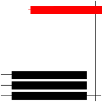
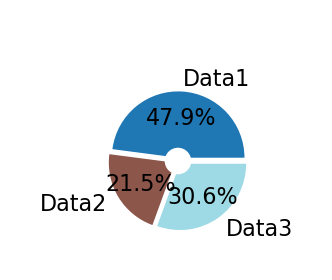
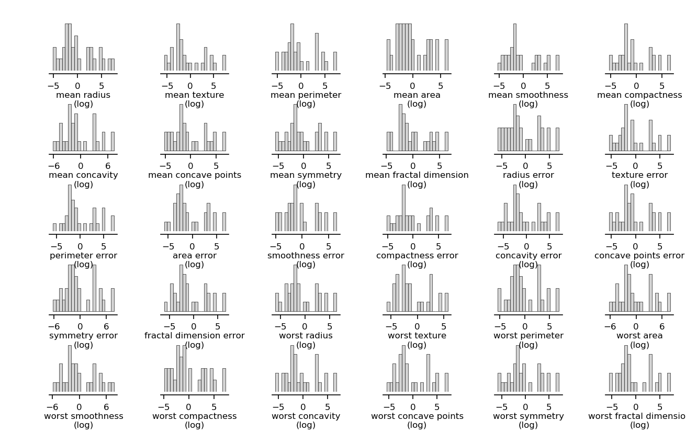
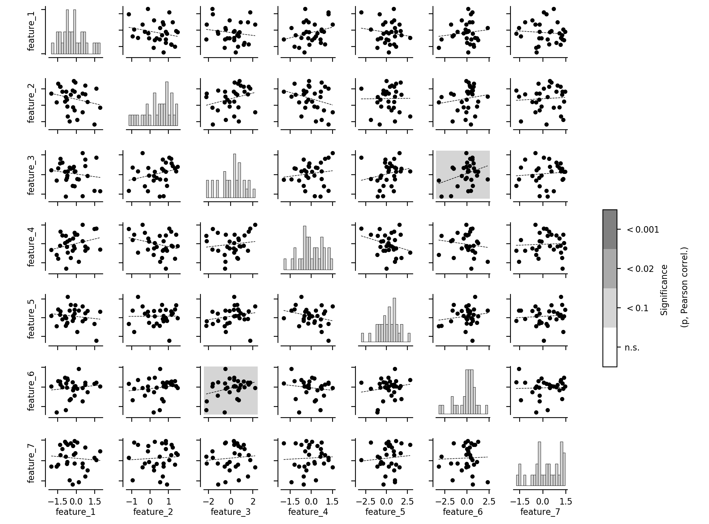
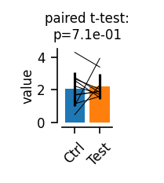
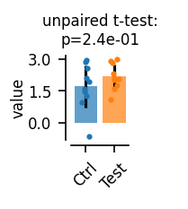
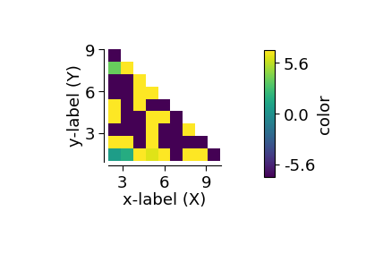
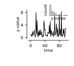

<div></div>

# datavyz

*Get your plots right, all along your analysis workflow. A layer on top of `matplotlib` to achieve flexible & high-standard data visualization across different mediums.*

## Principle / Use

Create a graph environment associated to a specific visualization setting, below "screen":

```
from datavyz.main import graph_env
ge = graph_env('screen')
```

You then call all of your plotting functions relative to this environment, e.g.:

```
import numpy

ge.plot(Y=numpy.random.randn(4, 10),
	sY=numpy.random.randn(4, 10),
        xlabel='xlabel (xunit)',
        ylabel='ylabel (yunit)',
        title='datavyz demo plot')
ge.show()
```
pops up:

<p align="center">
  
</p>

## Installation

Using *git* to clone the repository and "pip" to install the package in your python environment:

```
pip install git+https://github.com/yzerlaut/datavyz.git
```

## Quick demo

Building a complex multipanel figure with the module.

```
import datavyz

ge = datavyz.graph_env('manuscript')

# a more complex grid of axes:
fig, AX = ge.figure(axes_extents=[\
                                  [[3,1], [1,1]],
                                  [[4,1]],
                                  [[1,1], [2,1], [1,1] ] ],
                     figsize=[.95,.95])
AX[0].plot(np.random.randn(20))

t = np.linspace(0, 10, 1e3)
y = np.cos(5*t)+np.random.randn(len(t))

# leave first axis empty for drawing
AX[0][0].axis('off') # space for docs/schematic.svg

# time series plot
AX[0][1].plot(t, y)
ge.set_plot(AX[0][1], xlabel='xlabel (xunit)', ylabel='ylabel (yunit)')

# more time series plot
AX[1][0].plot(t[t>9], y[t>9], label='raw')
AX[1][0].plot(t[t>9][1:], np.diff(y[t>9]), label='deriv.')
AX[1][0].plot(t[t>9][1:-1], np.diff(np.diff(y[t>9])), label='2nd deriv.')
ge.set_plot(AX[1][0], xlabel='xlabel (xunit)', ylabel='ylabel (yunit)')

# scatter plot
ge.scatter(t[::10], t[::10]+np.random.randn(100),
           ax=AX[2][0], xlabel='ylabel (yunit)')


# bar plot
ge.bar(np.random.randn(8),
       COLORS=[ge.viridis(i/7) for i in range(8)],
        ax=AX[2][1], xlabel='ylabel (yunit)')

# pie plot
ge.pie([0.25,0.4,0.35], ax=AX[2][2], ext_labels=['Set 1', 'Set 2', 'Set 3'])


# looping on all plots to add the top left letter:
for l, ax in zip(list(string.ascii_lowercase), itertools.chain(*AX)):
   ge.top_left_letter(ax, l+'     ')

# saving the figure with all plots
fig.savefig('fig.svg')

# generating the figure with the addition of the drawing and saving it "fig.svg"
from datavyz.plot_export import put_list_of_figs_to_svg_fig
put_list_of_figs_to_svg_fig(['docs/schematic.svg', fig],
                            fig_name='fig.svg',
                            Props={'XCOORD':[0,0], 'YCOORD':[0,0]})

```

<p align="center">
  
</p>


## Settings

You can specifiy different environments corresponding to different visualization settings.

For example the setting to produce the above is the when `graph_env` is called with the `"manuscript"` argument is the following:
```
ENVIRONMENTS = {
    'manuscript': {
	'fontsize':9,
	'default_color':'k',
        'single_plot_size':(28., 20.), # mm
        'hspace_size':12., # mm
        'wspace_size':16., # mm
        'left_size':16., # mm
        'right_size':4., # mm
        'top_size':4., # mm
        'bottom_size':17., # mm
    },
    'screen': {
        'size_factor': 1.5,
    }
    'darkbg': { # dark background
        'size_factor': 1.5,
        'default_color': 'lightgray',
    }
}
```

An additional setting `"screen"` has only a "size_factor" key, so it takes the settings of the "manuscript" and expands everything by a factor 1.5 for the display on the screen. An additional setting `"darkbg"` is a display setting for displays with dark bakgrounds.

<p align="center">
  
</p>


## Features

We document here the different plotting features covered by the library:

### Pie plots

```
# building data
data = .5+np.random.randn(3)*.4

#plotting
fig, ax = ge.pie(data,
				 ext_labels = ['Data1', 'Data2', 'Data3'],
				 pie_labels = ['%.1f%%' % (100*d/data.sum()) for d in data],
				 ext_labels_distance=1.2,
				 explodes=0.05*np.ones(len(data)),
				 center_circle=0.2,
				 COLORS = [ge.tab20(x) for x in np.linspace(0,1,len(data))],
				 # pie_args=dict(rotate=90), # e.g. for rotation
				 legend=None) 
				 # set legend={} to have it appearing
fig.savefig('./docs/pie-plot.png', dpi=200)
```
Output:

<p align="center">
  
</p>

### Features plot

```
# data: breast cancer dataset from datavyz.klearn
from datavyz.klearn.datasets import load_breast_cancer
raw = load_breast_cancer()

# re-arange for plotting
data = {}
for feature, values in zip(raw['feature_names'], raw['data']):
	data[feature+'\n(log)'] = np.log(values)

# plotting
fig, AX = ge.features_plot(data, ms=3,
						   fig_args={'left':.1, 'right':.3, 'bottom':.1, 'top':.1,
									 'hspace':.4, 'wspace':.4})
fig.savefig('docs/features-plot.png', dpi=200)
```
<p align="center">
  
</p>

### Cross-correlation plot

Look at the cross-correlation between several joint measurements and estimate the signficance of the correlation:
```
# building random data
data = {}
for i in range(7):
	data['feature_%s'%(i+1)] = np.random.randn(30)

# plotting
fig = ge.cross_correl_plot(data,
                          features=list(data.keys())[:7])

fig.savefig('./docs/cross-correl-plot.png', dpi=200)
```
Output:

<p align="center">
  
</p>


### Bar plots

#### Classical bar plot

```
ge.bar(np.random.randn(5), yerr=.3*np.random.randn(5), bottom=-3, COLORS=ge.colors[:5])
```

#### Related sample measurements
```
fig, ax, pval = ge.related_samples_two_conditions_comparison(np.random.randn(10)+2., np.random.randn(10)+2.,
															 xticks_labels=['$\||$cc($V_m$,$V_{ext}$)$\||$', '$cc(V_m,pLFP)$'],
															 xticks_rotation=45, fig_args={'bottom':1.5, 'right':8.})
fig.savefig('docs/related-samples.png', dpi=200)
```

<p align="center">
  
</p>

#### Unrelated sample measurements
```
fig, ax, pval = ge.unrelated_samples_two_conditions_comparison(np.random.randn(10)+2., np.random.randn(10)+2.,
															   xticks_labels=['$\||$cc($V_m$,$V_{ext}$)$\||$', '$cc(V_m,pLFP)$'],
															   xticks_rotation=45, fig_args={'bottom':1.5, 'right':8.})
fig.savefig('docs/unrelated-samples.png', dpi=200)
```

<p align="center">
  
</p>

### Line plots

#### Simple trace plot with X-and-Y bars for the labels

```
fig, ax = ge.plot(t, x,
                  fig_args=dict(figsize=(3,1), left=.4, bottom=.5),
                  bar_scale_args = dict(Xbar=.2,Xbar_label='0.2s',
                                        Ybar=20,Ybar_label='20mV ',
                                        loc='left-bottom'))
```

<p align="center">
  
</p>

### Scatter plots

```
from datavyz.main import graph_env
ge = graph_env('manuscript')

fig, ax = ge.scatter(Y=np.random.randn(4, 10),
                     sY=np.random.randn(4, 10),
                     xlabel='xlabel (xunit)',
                     ylabel='ylabel (yunit)',
                     title='datavyz demo plot')
```

<p align="center">
  
</p>

### Surface plots

```
# BUILDING THE DATA
x, y = np.meshgrid(np.arange(1, 11), np.arange(1, 11))
z = np.sqrt(x*y)
x, y, z = np.array(x).flatten(),\
          np.array(y).flatten(),\
          np.array(z).flatten()*np.random.randn(len(z.flatten()))
index = np.arange(len(x))
np.random.shuffle(index)
x, y, z = x[index], y[index], z[index]

# PLOT
fig, ax, acb = ge.twoD_plot(x, y, z,
                            vmin=-7, vmax=7,
                            bar_legend={'label':'color',
                                        'color_discretization':20})
ge.set_plot(ax, xlabel='x-label (X)', ylabel='y-label (Y)')
```

<p align="center">
  
</p>


### Insets

```
from datavyz.main import graph_env
ge = graph_env('manuscript')

y = np.exp(np.random.randn(100))
fig, ax = ge.plot(y, xlabel='time', ylabel='y-value')
sax = ge.inset(ax, rect=[.5,.8,.5,.4])
ge.hist(y, bins=10, ax=sax, axes_args={'spines':[]}, xlabel='y-value')
fig.savefig('docs/inset.svg')
ge.show()
```

<p align="center">
  
</p>


